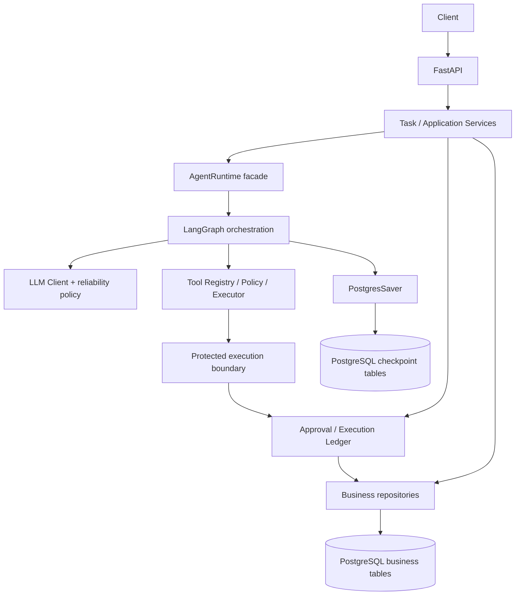
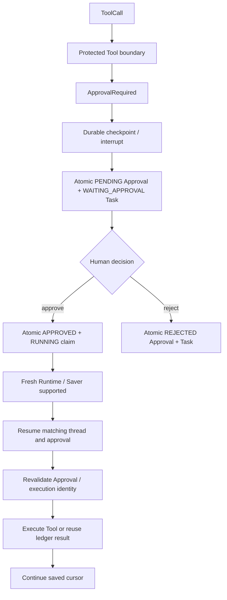
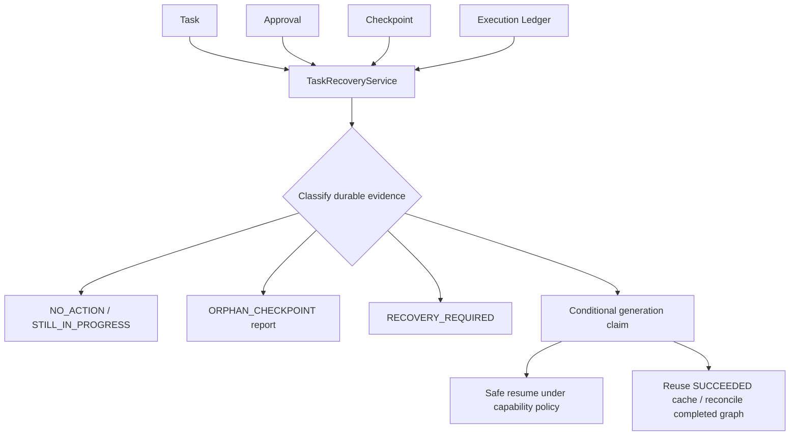

# AgentFlow-AI

面向可靠任务执行的 AI Agent 后端：让模型提出 Tool 调用，由应用控制安全边界、人工审批、持久化继续执行与故障恢复。

**440 tests passed · Container Delivery Qualified · CI Automation Qualified · GitHub-hosted CI PASS**

## Project Overview

AgentFlow-AI 将一次模型交互变成可查询、可暂停、可继续的 Task。项目重点是外部调用失败、人工审批跨请求以及进程重启时，如何依据持久化证据继续工作，并在无法确认安全性时停止。

已验证状态以 [CURRENT_STATE](docs/CURRENT_STATE.md) 为准；生产部署与真实 provider 生产级验证尚未完成。阅读 [项目总结](docs/FINAL_PROJECT_REPORT.md)、[简历材料](docs/RESUME.md) 或 [面试指南](docs/INTERVIEW_GUIDE.md) 可快速了解设计取舍。

## Why This Project Exists

普通对话接口主要交付回答；执行型 Agent 还需要管理 Tool 的副作用、审批权限、执行结果和恢复边界。例如，一次需要审批的外部操作可能在执行后丢失响应。此时重新发起整个任务可能重复产生副作用，直接宣布失败也可能与真实结果冲突。

本项目将这些问题落实为独立的 Domain、持久化记录和执行策略：模型决定“建议调用什么”，系统决定“是否允许、如何执行、什么时候可以再次执行”。默认注册的 Tool 是 Calculator；受保护 Tool 的审批与恢复链路通过受控测试实现验证，没有接入真实支付、邮件等外部副作用服务。

## Core Capabilities

| Capability | Status | Implementation |
| --- | --- | --- |
| Agent Tool Calling | 已实现并验证 | AgentRuntime façade + LangGraph 有界循环、多 ToolCall 与结果回填 |
| Task Persistence | 已实现并验证 | PostgreSQL、TaskRepository、状态查询与过滤 |
| Retry/Backoff | 已实现并验证 | 显式 timeout、可重试分类、次数上限、指数 backoff 与 jitter |
| Tool Safety | 已实现并验证 | Registry 元数据、side_effect_free、fail-closed policy |
| HITL Approval | 已实现并验证 | 独立 Approval、原子暂停、approve/reject |
| LangGraph Durable Workflow | 已实现并验证 | StateGraph、PostgresSaver、checkpoint、interrupt/resume |
| Cross-process Resume | 已实现并验证 | 稳定 thread_id，fresh Runtime/Saver 从持久化状态继续 |
| Execution Ledger | 已实现并验证 | 独立执行 UUID、唯一约束、条件 claim、结果状态 |
| Idempotency Protection | 已实现，有边界 | 稳定 key、SUCCEEDED 缓存复用、能力约束下恢复 |
| Recovery / Reconciliation | 已实现，有边界 | 操作者触发、多源证据分类、generation fencing |
| Observability | 已实现并验证 | 18 类生命周期事件、JSON 日志、请求与任务关联 |
| Docker | Qualified | 非 root backend、PostgreSQL 17、双 schema 初始化与健康检查 |
| CI | Qualified；hosted run PASS | PostgreSQL 全套测试门禁与无缓存镜像构建 |
| Deployment | Not Yet Qualified | 未进行目标生产环境部署验收 |
| Real Provider Validation | Not Yet Qualified | 当前验收使用受控 provider，不代表真实账号/生产验证 |

## Architecture



图中的两个 PostgreSQL 区域可位于同一个数据库，但 schema owner 与提交边界不同。Alembic 管理业务表；PostgresSaver 管理 checkpoint 表。二者与外部副作用之间没有统一事务。

**LangGraph** 负责 workflow orchestration、checkpoint、interrupt/resume 与 state progression。**AgentFlow 自研层**负责 Task/Approval Domain、Tool safety、Execution Ledger、idempotency policy、recovery/reconciliation、LLM reliability、application services、observability semantics 和 API boundary。AgentRuntime 是应用入口 façade，复用 LangGraph 的编排能力而保留业务控制权。详细设计见 [ARCHITECTURE](docs/ARCHITECTURE.md)；该文档含阶段演进说明，当前能力以此主页和状态快照为准。

## Runtime Flow

`POST /api/agent/run → Task RUNNING → LLM → ToolCall → 安全检查/执行 → ToolResult 回填 → 下一轮或终止`

循环受 max_steps 约束。最终回答写入 Task SUCCEEDED；已知失败进入相应失败处理；需要审批时暂停而不是提前执行。`GET /api/tasks/{task_id}` 与 `GET /api/tasks` 提供持久化状态、分页和过滤。

LLM 单次 HTTP 请求具有显式 timeout；timeout/network、429/5xx 等按策略分类后有界重试，4xx 和非法响应不会被一概重试。重试间隔使用指数 backoff 和 bounded jitter，耗尽后传播错误，不无限等待。

## Tool Safety & HITL

Tool 安全信息来自可信 Registry 元数据，不信任模型传入的安全标志。只有明确 `side_effect_free=True` 才允许自动执行；未知或可能有副作用的 Tool 默认 fail closed，通过持久化 Approval 获得授权后再进入受保护执行边界。



approve 路径通过条件更新竞争单一 continuation 所有者；reject 不执行 Tool，也不等同技术失败。模型提出调用意图不等于人类授权。API 是审批交互入口，本项目未提供审批前端或生产身份权限平台。

## Durable Workflow & Resume

Task UUID 映射为稳定的 LangGraph thread_id。checkpoint 保存可序列化 workflow 状态，包括 ToolCall 游标与暂停上下文；Session、HTTP client、Tool 实例不进入状态。新进程可以重新创建 Runtime/Saver，从同一 thread 恢复，无需重新提交最初输入。

先 checkpoint、后原子保存业务暂停记录，保证确认的 WAITING_APPROVAL 有可继续状态。该顺序仍可能留下跨存储不一致窗口，恢复服务必须检查事实，不能把 checkpoint 当作审批授权。正常恢复保留步骤预算和执行位置；未覆盖任意版本迁移或任意图状态的通用恢复。

## Execution Ledger & Idempotency

每次受保护执行具有独立 execution UUID、稳定 idempotency key，以及 `(task_id, tool_call_id)` 唯一约束。数据库条件 claim 决定执行所有者，Ledger 记录 EXECUTING、SUCCEEDED、FAILED、UNKNOWN。

- SUCCEEDED：读取持久化结果，重放不再次执行该 Tool。
- EXECUTING / UNKNOWN：普通路径停止，不盲目重新执行。
- NONE：没有可依赖的重复执行保障；不确定结果需进一步处理。
- EXTERNAL_KEY / INHERENT：恢复仅在声明的幂等能力真实有效、授权与证据匹配时成立；EXTERNAL_KEY 复用同一外部 key，不能每次生成新 key。

Ledger 不覆盖所有 safe Tool 或整个 HTTP 请求的去重，也不消除外部系统与本地数据库之间的故障窗口；项目不承诺 universal exactly-once。

## Recovery & Reconciliation

`POST /api/tasks/{task_id}/recover` 由操作者显式触发 `TaskRecoveryService`，没有后台扫描器或自动重试队列。



最近活跃的 RUNNING/EXECUTING 保留为进行中。stale 只允许评估，不证明旧执行者已经停止。对匹配的 APPROVED 上下文，恢复可复用成功 Ledger 结果、修复已完成图与 Task 的结果不一致，或在 EXTERNAL_KEY/INHERENT 能力下认领不确定执行。证据缺失、冲突或不安全的 UNKNOWN 保持 RECOVERY_REQUIRED；孤儿 checkpoint 只报告，不删除。

generation fencing 使用条件写入匹配预期状态和 updated_at：旧执行者丢失所有权后，不能覆盖新一代的 Task/执行结果。它不是 worker lease，也不能阻止已经发往外部系统的副作用。commit acknowledgement uncertainty 表示“提交确认丢失”，恢复时重新读取 durable truth，而非假定数据库回滚。

## Observability

18 类生命周期事件覆盖 Task、Approval、Tool、workflow、recovery 和 LLM attempt/retry。服务端生成 request_id 并返回 X-Request-ID；task_id 关联跨请求生命周期，辅以 thread_id、approval_id、execution_id 和 tool_call_id。

事件属性使用 allowlist，默认排除 API key、Tool 参数值/结果、prompt、消息正文和原始异常字符串。ContextVar 在请求结束时复位。日志 sink 失败被隔离，不改变业务结果；事件尊重提交确认与执行代际边界。日志为 best-effort 证据，可能丢失，不能替代持久化审计或数据库事实，也不保证 sink 延迟有界。

## Technology Stack

| 技术 | 选择理由与本项目职责 |
| --- | --- |
| Python 3.11 / FastAPI / Uvicorn | 清晰的 API 与应用边界；提供同步执行、查询、审批和恢复 HTTP 入口 |
| PostgreSQL 17 | 用事务、唯一约束及条件更新保存业务事实和竞争结果 |
| SQLAlchemy | Repository 内实现 ORM 映射与短事务，Domain 不等于数据库 Record |
| Alembic | 显式升级业务 schema；不接管 LangGraph 表 |
| LangGraph | 复用 StateGraph 编排、状态推进和 interrupt/resume 能力 |
| PostgresSaver | 把 workflow checkpoint 从进程内存移到 PostgreSQL |
| httpx | OpenAI-compatible HTTP 通信及可控的超时/错误测试入口 |
| Pydantic | 配置、消息、Tool 输入与 API DTO 校验 |
| pytest | 单元、真实数据库、并发和故障注入回归 |
| Docker / Compose | 明确 Python 环境、启动顺序与开发服务边界 |
| GitHub Actions | 独立环境执行初始化、零 skip/warning 门禁与镜像构建 |

## Quick Start

最快查看 API：使用下方 Docker 路径，无真实 provider 时可查看 health、Task 列表和 `/docs`。要获得真实模型回答，需要自行配置可用的 OpenAI-compatible provider。

Python 本地路径需要 Python 3.11 和预先创建的 PostgreSQL 17 数据库。从仓库根目录运行 PowerShell：

```powershell
New-Item -ItemType Directory -Force .venv/tmp | Out-Null
$env:TEMP = (Resolve-Path .venv/tmp).Path
$env:TMP = $env:TEMP
python -m venv .venv
.\.venv\Scripts\python.exe -m pip install --no-cache-dir -r backend/requirements.txt
.\.venv\Scripts\python.exe -m pip check
if (-not (Test-Path .env)) { Copy-Item .env.example .env }
```

编辑本地 `.env`：填写真实的 LLM_API_KEY、LLM_BASE_URL、LLM_MODEL 和宿主可访问的 DATABASE_URL。不要提交 `.env`。随后仍从仓库根目录运行：

```powershell
Set-Location backend
# 设置 process DATABASE_URL，确保也提供给只读环境变量的 setup CLI。
$env:DATABASE_URL = (& ..\.venv\Scripts\python.exe -c "from app.core.config import get_settings; print(get_settings().database_url)")
..\.venv\Scripts\python.exe -m alembic upgrade head
..\.venv\Scripts\python.exe -m app.workflows.setup
..\.venv\Scripts\python.exe -m alembic check
..\.venv\Scripts\python.exe -m uvicorn app.main:app --host 127.0.0.1 --port 8000
```

DATABASE_URL 的赋值捕获到进程变量，不要打印该变量。Alembic 当前也需要 LLM 配置（TD-005）；不调用真实 provider 的初始化/测试可使用无害占位值。初始化是显式命令，不在 FastAPI import/lifespan 内执行。

另开终端验证：

```powershell
Invoke-RestMethod http://127.0.0.1:8000/api/health
Invoke-RestMethod http://127.0.0.1:8000/api/tasks
# 仅在 provider 已配置时执行：
Invoke-RestMethod -Method Post -Uri http://127.0.0.1:8000/api/agent/run -ContentType 'application/json' -Body '{"message":"Calculate 2 plus 3."}'
```

返回 task_id 后可查询 `/api/tasks/{task_id}`。受保护 Tool 流程通过测试演示，不要期待默认 Calculator 自动产生 Approval。

## Docker

需要支持 Linux containers 的 Docker Engine/Desktop 与 Compose。从仓库根目录执行：

```powershell
docker compose -p agentflow-local up -d --build --wait
Invoke-RestMethod http://127.0.0.1:8000/api/health
Invoke-RestMethod http://127.0.0.1:8000/api/tasks
docker compose -p agentflow-local ps
```

backend 以 UID 10001 运行，默认仅在宿主 `127.0.0.1:8000` 暴露端口；可用 BACKEND_PORT 改宿主端口。PostgreSQL 仅在 Compose 内部网络可达。Compose 使用公开、development-only 的 `agentflow` / `agentflow_dev_only` 凭据；修改凭据时需要同时更新两服务配置，修改环境变量不会更改已有数据卷中的密码。

Compose 显式传入指向 `postgres` 的 DATABASE_URL，**不使用根 `.env` 中供宿主 Python 使用的 DATABASE_URL**。LLM_* 和恢复阈值可从 shell 或 `.env` 注入；默认 provider 占位值只适合启动及非模型 smoke，不能提供真实回答。镜像不包含 `.env`、宿主 venv 或真实凭据。

启动顺序：PostgreSQL TCP healthy → Alembic → PostgresSaver setup → exec Uvicorn。初始化失败非零退出并只输出安全的阶段信息；HTTP health 是 liveness，不是持续 DB/provider 就绪保证。

```powershell
# 独立无缓存构建证明：
docker build --no-cache -t agentflow-local .
# 重启会再次执行幂等初始化；保留数据库数据。
docker compose -p agentflow-local restart backend
docker compose -p agentflow-local up -d --wait
docker compose -p agentflow-local down
# 仅用于可丢弃的开发数据；会删除该项目数据库卷。
docker compose -p agentflow-local down -v
```

## Testing

正式 Reviewer / CI 基线为 **440 passed、0 failed、0 skipped、0 warnings**。覆盖 unit、integration、真实 PostgreSQL、LangGraph checkpoint、并发 claim、恢复与端到端链路；容器交付另有空卷、重启、健康及失败退出验证。Focused / high-risk 是全量集合的子集，不累加到 440。

从 `backend` 目录、使用已经初始化的**独立可丢弃测试数据库**运行；测试夹具会清理业务数据。设置 process DATABASE_URL 指向该测试库，并提供无害 LLM 配置；TEMP/TMP 使用前述仓库内路径。

```powershell
..\.venv\Scripts\python.exe -m alembic upgrade head
..\.venv\Scripts\python.exe -m app.workflows.setup
..\.venv\Scripts\python.exe -m scripts.qualified_tests -q
# 受控 provider 的审批、恢复与进程重启演示：
..\.venv\Scripts\python.exe -m scripts.qualified_tests -q tests/test_release_e2e.py
```

正式入口拒绝测试 skip、collection skip 和 warning。没有 DATABASE_URL 的普通 pytest 可能跳过数据库测试，其绿色结果不能作为完整验收。这里记录已有验证事实，不宣称文档包装任务重新运行了 440 项。

## CI

**Container Delivery = Qualified · CI Automation = Qualified · GitHub-hosted CI Run = PASS。**

此状态来自 [当前已确认快照](docs/CURRENT_STATE.md)，本轮不触发新的 hosted run，也不编造 run URL。[Workflow](.github/workflows/ci.yml) 对 main 的 push / pull_request 执行 Python 3.11 + PostgreSQL 17 验证：安装依赖与 pip check → Alembic → PostgresSaver setup → schema drift check → 全量门禁 → Docker 无缓存构建。CI 使用受控 provider/占位配置，无真实 provider 密钥、镜像发布或部署步骤。

## Key Design Decisions

- Domain 与 ORM 分离；Approval 表达授权，Task 表达生命周期（ADR-002）。
- 原子暂停/拒绝和 continuation claim 保证相关业务状态一致；checkpoint 保持独立 owner（ADR-003～006）。
- 独立执行身份与保守重放策略约束副作用；恢复依赖多源事实与条件写入（ADR-007～008）。
- Observability 明确脱敏、提交证据与 best-effort 边界（ADR-009）。
- 容器显式双 schema 初始化，CI 与生产部署分别验收（ADR-010）。

设计原因和代价见 [DECISIONS](docs/DECISIONS.md)，既有维护项见 [TECH_DEBT](docs/TECH_DEBT.md)。

## Project Status

应用核心、工程可重复性、容器交付与 CI Automation 已完成验证。当前交付包括可运行后端、测试、Docker/CI 以及项目说明材料；文档包装仍需 Independent Review，不能据此自行同步为项目已完成。

**Deployment Qualification 与 Real Provider Validation 均为 Not Yet Qualified。** 生产权限、目标部署、运维与真实外部服务验收不由一次绿色 CI 推导。

## Known Boundaries / Non-goals

- 未做 production deployment qualification 或 real provider production qualification。
- 无 worker/queue scheduler、后台自动恢复、Kubernetes 或部署平台。
- 无 universal exactly-once、跨 checkpoint/业务/外部副作用的统一事务或自动 UNKNOWN 强制重试。
- 无 persistent audit log、distributed tracing backend、Prometheus/Grafana。
- 无 multi-agent orchestration、MCP 或前端；审批/恢复接口也不等于完整生产权限体系。

这些是明确范围边界，不自动归类为 Technical Debt。受控测试中的副作用计数与恢复成功，不能推广成对任意真实外部系统的保证。
