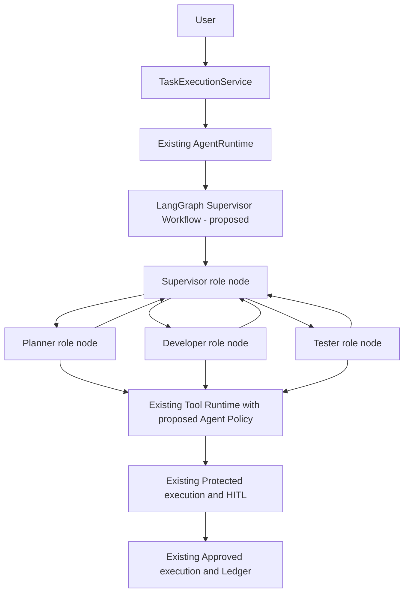

# Multi-Agent Architecture Design — TASK-035

**Status: Proposed — Awaiting Independent Review**
**Research date:** 2026-09-12
**Baseline inspected:** Git `df42f29`; working tree clean before this task.
**Scope:** Architecture research and documentation only. All new contracts, fields, tools and workflow behavior below are proposals, not implemented capabilities.

## 1. Background

AgentFlow-AI 已建立可靠的单 Agent 执行基础。扩展目标是 Reliable Multi-Agent Execution Platform，复用既有运行边界，而不是把多个独立执行引擎拼接起来。

本次任务要求来自用户提供的 TASK-035 定义；仓库尚无 `tasks/TASK-035.md`。CURRENT_STATE / AI_HANDOFF 中“无下一任务、不创建 TASK-035”属于先前收尾快照，与本次明确授权的新研究任务存在时序差异。本次仅修改指定四份文档，不将这些状态文件提前同步为 Completed，也不创建额外 Task 文件。

### Repository evidence / 已核对的事实

| 代码或测试 | 当前能力及对设计的约束 |
| --- | --- |
| [AgentRuntime](../backend/app/agents/runtime.py) | application-facing façade；run / resume / workflow_evidence / recover_execution / resume_pending_tool 复用现有服务；恢复检查硬编码 approval_pause / tool 节点及单一 pending_approval。 |
| [Agent workflow](../backend/app/workflows/agent.py) 与 [state](../backend/app/workflows/graph.py) | LLM、tool、独立 approval_pause 节点；tool_cursor 在暂停前保存；Task.id 映射 thread_id；当前没有 Agent identity 或多角色路由。 |
| [Protected execution](../backend/app/protected_execution.py) | safe Tool → ToolExecutor；其它已注册 Tool 产生未持久化 ApprovalRequired，由应用层完成持久化。 |
| [Approved execution](../backend/app/approved_execution.py) | persisted Approval 校验先于 Ledger cache / claim；保护执行必须配置 Ledger；不依赖 checkpoint 中的 approved 标志授权。 |
| [Tool metadata](../backend/app/tools/schemas.py) | side_effect_free 默认 false；idempotency_mode 为 NONE / EXTERNAL_KEY / INHERENT；没有 Agent Tool Policy。 |
| [Task recovery](../backend/app/tasks/recovery.py) | evidence-driven、operator-triggered recovery；支持的 checkpoint 形状有限，不能自动恢复任意新图。 |
| [Runtime tests](../backend/tests/test_agent_runtime.py)、[Ledger tests](../backend/tests/test_execution_ledger.py)、[protected execution tests](../backend/tests/test_protected_execution.py) | 覆盖 step budget、实例复用不泄露上下文、审批前不执行、claim 竞争、cache 必须有 persisted Approval、commit acknowledgement loss 等契约。本次只阅读，不声称重跑。 |

**准确的复用范围：** 当前 Ledger 覆盖 approved protected Tool execution，safe Tool 路径不会创建 Ledger 记录；不能宣称全部工具已具备持久化去重。Observability 是 best-effort 结构化日志，并非不可变审计。现有 recovery 不等于通用图恢复，也不保证 universal exactly-once。

## 2. Goals

- 用 Supervisor、Planner、Developer、Tester 分离编排、规划、修改建议和验证职责。
- 保持 TaskExecutionService → AgentRuntime → LangGraph Workflow → Tool Runtime。
- 使用可校验、可关联的 Agent 通信，明确谁派发、谁执行、输出属于哪次 invocation。
- 执行端权限隔离；角色切换、代理调用、恢复与缓存读取均不能扩大授权。
- 复用 checkpoint-first HITL、Execution Ledger、幂等能力、generation fencing、recovery 与 observability。
- 提供有限、可演示、可失败注入的软件工程 Demo；以可靠执行证据衡量价值，不追求 Agent 数量。

## 3. Non-goals

本任务不实现代码、数据库 migration、依赖或工具，不运行真实软件修改 Demo。后续首版也不引入 AutoGen / CrewAI / Agents SDK 的第二套 Runner，不新增 MultiAgentRuntime 生命周期。

首版不含多层团队、自由 peer-to-peer、动态创建角色、跨进程 Agent、消息队列、并行写仓库、多审批同时 pending、自动恢复扫描器、自动 push / merge / deploy。身份认证与生产部署 qualification 仍需专门验收；工具 allowlist 不是操作系统沙箱，也不能替代用户身份认证。

## 4. Industry Pattern Research

以下区分官方资料中的模式与本项目的选择。框架资料是模式参考，不意味着其执行、事务或安全语义与本项目相同。链接于研究日期查阅；版本浮动的文档不能代替后续锁定依赖后的验证。

### Framework evidence

| 来源 | 官方模式要点 | 对本项目的启示与采用边界 |
| --- | --- | --- |
| [Microsoft AutoGen Teams](https://microsoft.github.io/autogen/stable/user-guide/agentchat-user-guide/tutorial/teams.html) / [SelectorGroupChat](https://microsoft.github.io/autogen/stable/user-guide/agentchat-user-guide/selector-group-chat.html) | Teams 可轮流发言或由模型选择下一 speaker；SelectorGroupChat 使用共享对话、角色描述和终止控制。 | 借鉴角色、有限选择集和终止条件；不采用广播全部上下文或其团队执行循环。 |
| [CrewAI Processes](https://docs.crewai.com/v1.15.21/en/concepts/processes) / [Flows](https://docs.crewai.com/v1.15.21/en/concepts/flows) | hierarchical process 使用 manager 分派并检查结果；Flows 提供结构化状态、事件式流程和 persistence。 | 借鉴 manager / specialist 职责及显式流程；不叠加 Crew persistence，避免第二个恢复事实来源。 |
| [LangChain Subagents](https://docs.langchain.com/oss/python/langchain/multi-agent/subagents) / [Handoffs](https://docs.langchain.com/oss/python/langchain/multi-agent/handoffs) | Supervisor 可调用 subagents 并继续协调，子调用可隔离上下文；handoff 转移活跃 Agent，需要明确上下文传递。 | 保留 Supervisor 对最终结果的所有权；用现有 StateGraph 表达调用与返回，专业 Agent 首版为节点，不必另引 framework agent wrapper。 |
| [OpenAI Swarm](https://github.com/openai/swarm) / [Agents SDK orchestration](https://openai.github.io/openai-agents-python/multi_agent/) | Swarm 是教育性实验，仓库已指向 Agents SDK；后者区分 manager agents-as-tools 与接管当前对话的 handoff。 | 采用 manager 语义；handoff 可用于未来客服接管，首版软件工程流程无需自由转交。Swarm 不作为生产技术依赖。 |
| [OpenAI Agents SDK HITL](https://openai.github.io/openai-agents-python/human_in_the_loop/) | 工具审批可中断运行，RunState 可保存并恢复，嵌套 Agent 的审批可上浮至外层。 | 借鉴根任务可见的审批；具体授权仍由 AgentFlow Approval Domain / Services 完成，不引入 RunState 审批存储。 |
| [Azure Architecture Center](https://learn.microsoft.com/en-us/azure/architecture/ai-ml/guide/ai-agent-design-patterns) | 对比顺序、并发、群聊、handoff 等；强调最小权限、身份传播、成本、可观测性及 HITL。 | 企业可靠性来自明确控制边界和持久化事实，而不是角色数量；本项目选择有界、串行、可恢复的 Supervisor。 |

### Pattern trade-offs

| 模式 | 优势 | 风险 / 代价 | 本项目结论 |
| --- | --- | --- | --- |
| Supervisor | 单一派发点，统一预算、收敛、输出检查 | 协调模型成为延迟与质量瓶颈 | **选择**单层 Supervisor；程序校验路由，模型不能覆盖硬规则。 |
| Hierarchical Agent | 多领域团队可分级管理，缩小局部上下文 | 嵌套预算、审批、checkpoint 所有权和错误传播复杂 | Supervisor 是浅层层级；更深层延后，需证明规模收益。 |
| Peer-to-peer | 同行讨论灵活，适合探索与辩论 | 循环、权限代理、终止责任和消息因果难追踪 | 首版禁止横向派发；Tester 的反馈经 Supervisor 转交 Developer。 |
| 固定顺序 pipeline | 可预测、易验证、成本可控 | 不需要模型协调时，多一个 Supervisor 没有收益 | 作为对照基线；Demo 增加受约束返工与失败收敛，证明 Supervisor 的实际价值。 |
| Handoff | 专家直接接管用户交互，适合多阶段客服 | 控制权、对话历史与权限上下文一起切换 | 暂不采用自由 handoff；内部 delegation 完成后必须返回 Supervisor。 |

共享状态与消息传递不是持久化技术的二选一。前者适合保存协调进度，后者适合定义 Agent 间接口；将业务权限写进全局状态并让 Agent 自行修改，两者都无法保证安全。权限和人审必须在执行边界独立实施。

## 5. Selected Architecture

**选择：既有 AgentRuntime 内的单层 Supervisor StateGraph + 角色节点 + 单一既有 Tool Runtime。**



图表示调用边界与职责关系，三个专业 Agent **不并发执行**。工具安全自动执行支路及 checkpoint / business persistence 的详细责任如下。

| 边界 | 职责 | 禁止 |
| --- | --- | --- |
| TaskExecutionService 及现有应用服务 | Task lifecycle、审批与恢复协调、短事务和请求身份来源 | 让 LLM 决定数据库提交或 Task terminal transition |
| AgentRuntime | 唯一 application-facing run / resume / recovery façade；装配 workflow、依赖与受信执行上下文 | 每个 Agent 创建 Runtime、Session、LLM HTTP client 或独立资源生命周期 |
| LangGraph workflow | 路由、调用顺序、消息引用、预算、cursor、checkpoint、interrupt | 存储 ORM / Session；将 Approval / Ledger 业务判断迁入 state / reducer |
| Agent definition 与角色节点 | 选择 prompt 和可见工具；接收明确输入并产生结构化提案 / 结果 | 自行执行工具函数、授予权限、访问数据库 |
| Tool Runtime | policy、输入校验、protected execution、approved Ledger 执行、能力约束 | 通过新 shell wrapper、框架默认 ToolNode 等建立旁路 |
| Infrastructure | 继续按现有 owner 提供数据库、checkpointer、LLM client 资源 | Agent 创建表、初始化数据库或长期占用事务 |

不采用 `MultiAgentRuntime → Supervisor Graph → Agent Graph → Existing AgentRuntime`：这会反转现有 façade 与 graph 的依赖方向，并可能重复持有 thread、预算、客户端和生命周期。首版复用角色执行节点；只有实际出现复杂子流程需求后才评估 subgraph，仍由同一个根 Runtime 管理。

### Demo selection and behavior

候选比较：研究摘要助手容易实现但难证明 protected Tool / HITL；客服 handoff 能展示接管但不突出代码产物和 Tester；软件工程助手可展示完整的计划、变更、审批、验证、恢复证据，故选为首版候选。

输入“实现一个功能需求”时，若缺少可验证需求，Supervisor 返回澄清结果结束当前运行；首版不另造需求审批 Domain。演示 fixture 提供一项具体需求、只读验收标准和隔离的示例工程。

1. Supervisor 形成受约束 dispatch；Planner 输出 plan、acceptance criteria、风险与上下文引用。
2. Developer 读取指定 snapshot，产出 patch proposal 和预期基线 hash。
3. 修改提案进入既有 protected execution；人类审查具体 diff、路径、Agent 和工具参数后批准或拒绝。
4. 批准后通过 Ledger claim 执行变更；Tester 在该产物版本上运行受控测试，返回结构化结果与工具证据。
5. 测试通过后 Supervisor 汇总需求、diff 与验证证据；失败时可派发 Developer 修正，再触发新的审批与测试。
6. 拒绝即沿现有语义 REJECTED 整个 Task；未知执行结果进入既有 recovery 处理，不以“换一个 Agent”规避。

建议首版最多 2 次返工、12 次角色派发；每个角色 invocation 最多 5 次 LLM 决策，根任务最多 60 次 LLM 决策、30 次工具请求。运行预算持久化、恢复不重置；非法 dispatch、schema 失败、预算耗尽必须有明确失败结果。Provider retry 保持既有上限，并计入成本观测。数值为待评测默认值，不是现有配置；wall-clock / token 硬预算需在后续任务明确实现能力，不能虚称已有。

返工前必须有上一轮 Tester 结果；Tester 不能在 patch 未批准应用时验证旧版本并宣称通过。Supervisor 不能凭自然语言“通过”覆盖缺失的工具证据；失败测试是可返工结果，基础设施失败 / 工具不确定性走原有错误契约。任何重新派发不得重开已终止 Task。

### Durable reuse and compatibility gates

- 根 workflow 保持 `thread_id = str(Task.id)`；专业 Agent invocation 不是新的业务 Task，不独立持有 checkpointer。
- 增加 workflow_kind / schema_version 与 definition version 引用；老 checkpoint 缺少新标识时按现有单 Agent 路径解释，禁止猜测转换。新任务显式选择 workflow；恢复必须按持久化类型选图，不能套用当前默认图。
- 根 state 保存 active invocation、accepted dispatch / output、预算和 pending Tool cursor。Supervisor 已接受的决定先 checkpoint，再进入可能产生副作用的工具节点，避免重启生成不同动作。
- 现有恢复依赖具体 next_nodes、pending_approval、tool_cursor。TASK-037 必须给出新图 WorkflowEvidence 适配；保留旧单 Agent 检查，TASK-039 验证新图 protected recovery。缺失版本 / 不支持形状 fail closed，不能用初始输入重跑。
- checkpoint、业务事务和外部副作用继续分离；既有 generation fencing、execution claim、SUCCEEDED cache、UNKNOWN 语义保留。新图不承诺 crash-safe exactly-once。
- 任意新写工具上线前必须通过权限、审批身份、Ledger 和恢复验收；read-only workflow 的完成不代表 protected Multi-Agent 已可用。

## 6. Agent Model

引入轻量、不可变、可版本化的 **AgentDefinition**，而非带 ORM / database lifecycle 的主动 Agent Entity。它回答“扮演什么角色、接受什么输入、可请求哪些能力”；Runtime 回答“如何可靠执行及何时暂停 / 恢复”。

| 拟议字段 | 含义 |
| --- | --- |
| agent_id、name、role、version | 稳定标识、展示名、职责、不可变版本；不要将用户内容放入标识 |
| system_prompt / prompt_ref | 受控提示词或版本引用；不含凭据 |
| allowed_tools、policy_ref | 可请求工具集合及资源限制引用；是上限声明，不是授权凭证 |
| input_schema、output_schema | 结构化 invocation 与结果契约 |
| model_profile_ref、max_steps | 复用 LLMClient 的模型配置引用和角色预算；不持有 client |
| metadata | 有限说明与分类；不允许可执行对象、Session、任意权限字段 |

另设 invocation envelope（概念契约）：task_id、invocation_id、agent_id/version、parent_invocation_id、attempt、input_refs、correlation_id。attempt 用于可观测性，不能改变同一工具操作的执行身份。

**AgentRegistry：需要。** 首版为启动时加载的静态、只读定义目录：按 ID 查找、验证唯一性及 schema、校验工具名存在、解析版本和 policy 引用、列出 Supervisor 可委派的角色。不做网络 discovery、动态插件加载或数据库管理。

Registry 提供策略配置，执行端 AgentToolPolicy 才负责强制检查。运行期间不能靠 LLM 输出修改 Registry；恢复时必须能解析固定版本，缺失则拒绝继续。当前策略撤销可收紧旧任务权限，历史 definition / approval 不能绕过撤销。

Supervisor 只拥有派发和汇总能力，不拥有 Developer 的工具权限；派发目标由单独的 delegation allowlist 约束。首版只有 Supervisor 可派发专业 Agent，禁止专业 Agent 自主委派或冒充 Supervisor。

## 7. Communication Model

**选择 B：结构化 Message Passing 作为逻辑接口；checkpoint-backed shared coordination state 作为承载。** 首版在同一进程、同一根图中传递，不引入消息总线或 Agent 自建数据库。

| 维度 | A：全局可变 Shared State | B：受控 Message Passing（选择） |
| --- | --- | --- |
| 上下文 | 易用但易泄露无关历史 | 按接收者投影输入，只发送必要产物 |
| 修改权 | 多角色写同一键难辨责任 | 接收角色返回结果，协调节点验证并合入 |
| 恢复 | snapshot 简单，但冲突与来源不清 | 消息身份、因果、消费进度需要明确保存 |
| 代价 | schema 容易膨胀为业务对象仓库 | 需要契约、校验、去重和版本管理 |
| 并发 | 共享覆盖与合并风险 | 可以演进为队列，但首版没有分布式投递承诺 |

拟议 AgentMessage 字段：schema_version、message_id、task_id、sender_agent_id、recipient_agent_id、invocation_id、in_reply_to、kind（dispatch/result/feedback/error）、sequence、payload / artifact_refs。执行环境设置 sender 和 task 身份；不信任模型自填这些字段。

- Supervisor 的 dispatch 必须针对 Registry 中允许的目标；result 必须匹配待完成 invocation；Tester feedback 由 Supervisor 验证后派发。
- 每次接受输出时按 message_id / invocation_id 去重，并在同一次 workflow state 更新中保存 accepted result 与消费进度。相同 ID 不同 payload 拒绝；未知、跨 Task、过时结果拒绝。
- 根协调节点拥有共享进度写权。角色只获得输入副本，不能任意返回全局 state patch；state 保存 DTO、引用和进度，不保存业务权限真值。
- 产物使用 task-scoped artifact ID、版本、content hash、基线 hash；读取引用也执行资源授权。首版产物先保存在 checkpoint 可承受的小型结构或受控 Tool workspace，禁止只存重启后丢失的临时路径。
- 模型消息需保留 ToolCall / ToolResult 配对；对外部 AgentMessage 与 provider 原生消息使用显式适配。只发送计划 / diff / 测试摘要和必要证据，不广播完整私有历史或隐藏推理。
- 消息 / 源码 / 测试输出视为不可信内容，不得升级为 system prompt 或 permission。定义 payload 尺寸上限、截断 / 拒绝规则和敏感信息过滤。
- LLM 在尚未 checkpoint 的无副作用节点可能重算，不能承诺模型输出 exactly-once。已接受的结果与工具操作身份必须保持稳定；协调消息不是 Tool execution Ledger 的替代品。

## 8. Tool Permission Model

权限判断必须与副作用判断分开：

`effective_permission = Agent role grant ∩ task/user resource scope ∩ deployment policy`

默认拒绝；不存在用户认证时不得伪造 user scope 已受保护。首版本地 Demo 采用受信任务上下文和受限 workspace，生产多租户认证仍是门槛。HITL 只能批准已允许的动作，不能把 deny 升级为 allow。

| 角色 | 拟议允许工具 | 资源 / 操作约束 |
| --- | --- | --- |
| Supervisor | 无业务工具；只用工作流派发协议 | 不能借 Developer 身份直接发 ToolCall |
| Planner | repo_read、calculator；可选受控 search | 只读 fixture / 任务允许资料；search 涉及外发数据，需单独策略 |
| Developer | repo_read、apply_patch | 仅任务 workspace 的明确路径与基线；无通用 shell、Git push、凭据或宿主写入 |
| Tester | repo_read、run_tests | 固定 runner profile、已确认 artifact hash、隔离执行；不能修改产品代码或验收标准 |
| ResearchAgent（扩展示例，不加入 Demo） | search、calculator | 限定域名、出站内容、输入大小；无文件写和执行权限 |

以上除 calculator 外均为未来工具名称。Developer 的“代码执行”需求首版交由 Tester 的受控 runner，避免给 Developer 任意 shell。Tester 可在结果中提出新测试建议；改变验收标准或 fixture 需要新的受控变更流程。

### Enforcement path

1. Runtime 根据受信 invocation 生成执行上下文；LLM 只提交工具意图，不提供 actor identity、allow 或 safety flag。
2. 可见工具 schema 按角色过滤以改善模型行为；**过滤不是安全边界**。
3. 在现有 Tool Runtime 各入口加入同一 AgentToolPolicy：正常执行、approved resume、cached result 返回、operator recovery 均校验角色 / Task / 资源绑定。安全工具也必须检查权限。
4. 权限允许后，继续从真实 ToolRegistry 获取 metadata 并按现有 ToolExecutionPolicy 分流：side_effect_free=true → 既有 ToolExecutor；否则走 ApprovalRequired → 应用层 durable pause。
5. 批准后经既有 ApprovedToolExecutionService 验证 persisted Approval 与完整调用上下文，再 Ledger claim / cache / execution。未知工具仍保留 ToolNotFoundError，不创建伪审批。

run_tests 可执行仓库中的任意恶意代码、产生缓存、启动子进程；不能因名称含“test”就声明 side_effect_free=true。首版按 protected Tool 处理，限制网络、环境变量、挂载、工作目录、资源与超时。即使审批通过，也必须在隔离环境执行。文件工具校验规范化路径、链接 / junction 逃逸、允许根目录和 hash，不能靠 prompt 限制路径。

### Identity, approval binding and replay

当前 Ledger 唯一约束是 (task_id, tool_call_id)，直接复用不同 Agent 的 provider call ID 会碰撞。拟议做法是在首次接受调用时生成内部、Task 内唯一的 operation ID，作为执行 ToolCall.id；持久保存 provider_call_id → operation_id 的映射，并在反馈 provider 时转换回原 ID。

重启 / resume / capability-aware recovery 保留 operation ID、execution UUID 和 idempotency key。新的返工动作生成新 operation ID，并重新审批；不使用 attempt、角色轮次或内容 hash 单独充当幂等身份。输入相同不代表同一个业务动作。

TASK-036 定义、TASK-039 落地 operation 与 agent_id/version、invocation_id、policy version、resource scope 的 durable 绑定，优先扩展既有 Approval / ToolExecution 契约及 Repository，不建立第二个执行记录系统。checkpoint 的身份引用只能做 correlation，授权必须与业务持久化绑定核对；具体新增字段和 migration 需后续任务独立审查。

执行结果缓存也先检查当前权限和 persisted Approval，避免结果泄露给其他角色。参数、目标、产物 hash 或 actor 变更使原审批失效；撤销策略不能被恢复绕过。Safe Tool 保持原有无 Ledger 路径，其重放可能重新读取不同数据，Demo 必须用版本化 snapshot，且不得给该路径添加隐含写动作。

## 9. HITL Integration

沿用 ADR-006/007/008，而不是每个 Agent 一个审批系统。首版同一根 Task 同时最多一个 pending protected Tool；根图暂停期间不派发其它 Agent。

```text
Role produces Tool intent
  → AgentToolPolicy allows request
  → existing ProtectedToolExecutionService identifies approval need
  → save active invocation + normalized ToolCall + cursor + pending correlation
  → synchronous checkpoint → separate approval_pause interrupt
  → AgentRuntime raises ApprovalRequired
  → TaskExecutionService / HITLPausePersistence commit Approval + WAITING_APPROVAL
  → existing decision service approve/claim or reject
  → same AgentRuntime resumes matching workflow version
  → revalidate actor policy + persisted Approval + exact operation
  → existing ApprovedToolExecutionService / Ledger
  → tool result → role result → Supervisor
```

[LangGraph interrupts 文档](https://docs.langchain.com/oss/python/langgraph/interrupts)明确恢复会从中断节点开头重跑，子图调用还可能重跑父节点。因此沿用独立无副作用 pause node；不得在 interrupt 前写文件、执行测试或创建无法复用的新调用身份。

审批界面 / DTO 的未来扩展应显示 task、agent、invocation、工具、规范化参数、diff / artifact hash、影响范围、到期策略（若启用）。这些展示字段不是授权来源；审批决策必须对绑定的业务事实进行校验。计划认可不等于工具执行批准。参数编辑视为新操作，不能覆盖旧 Approval。

| 故障 / 决策 | 预期行为及证据 |
| --- | --- |
| 人工拒绝 | 原子 REJECTED Approval + REJECTED Task，不派发替代 Agent 重试 |
| 两次批准 / approve 与 reject 竞争 | 既有条件写保持一个赢家，至多一次 continuation dispatch |
| checkpoint 已写、pause 业务写失败 | 沿用 checkpoint-first 不确定性处理；不得执行，后续由现有恢复服务核对事实 |
| approve claim 后进程退出 | fresh Runtime 使用持久化工作流类型、actor / operation 绑定与既有恢复规则 |
| 外部动作成功、Ledger SUCCEEDED 已提交、graph 进度丢失 | 校验后复用结果；effect count 不增加 |
| EXECUTING / UNKNOWN 或 result commit 未确认 | 不盲重试、不自动换 Agent；按原有 capability / staleness / fresh evidence 规则处理 |
| 不兼容 graph version、丢失产物、actor 绑定不符 | fail closed；按现有生命周期进入需人工恢复的处理，不重建初始输入 |
| 策略已撤销 | 原审批不扩大权限，停止执行 / 缓存返回；由应用层明确拒绝原因 |

### Observability and evaluation

复用既有 event/context/sink；拟议扩展 agent_id、invocation_id、parent_invocation_id、workflow_kind/version 及委派 / 返回 / policy denied 事件。新增字段必须加入现有 allowlist，不伪装成既有字段；日志继续排除 prompts、源码、参数和工具输出。日志不替代 Approval / Ledger / checkpoint。

后续验收以稳定 fixture + stub LLM 控制失败场景；真实 Provider 另作开发环境演示。记录需求满足率、无证据成功率、权限拒绝、重复 effect count、恢复结果、token / latency（可获取时）及派发次数，并与单 Agent / 固定 pipeline 比较；不得先宣称 Multi-Agent 必然更快或更准确。

## 10. Future Tasks

| Task | 范围与依赖 | 必须交付的验收证据 |
| --- | --- | --- |
| TASK-036 — Agent abstraction and contracts | ADR-011 审查后；AgentDefinition / Registry、AgentMessage、受信 invocation、policy / operation identity 契约 | 未知角色 / 工具、伪造身份、schema / 版本错误拒绝；实例复用不泄漏上下文；保持 single-agent contract |
| TASK-037 — Supervisor workflow | 依赖 036；同一 AgentRuntime 内有界串行 graph，先用无副作用工具 / 测试替身 | dispatch / 返回 / 返工、预算恢复不重置、旧 checkpoint 兼容、新 WorkflowEvidence 适配；此阶段禁止开放写工具 |
| TASK-038 — Tool expansion and isolation | 依赖 036/037；现有 Tool system 新增 repo_read、patch、受控 test runner；默认不向 live graph 开放写工具 | 路径 / junction 逃逸、跨 Task 资源、命令注入、网络 / secrets / timeout 隔离；副作用与 idempotency 声明验证 |
| TASK-039 — Multi-agent HITL / Ledger / recovery | 依赖 036–038；durable actor-operation 绑定及必要 migration、批准 / 拒绝、角色 policy 全入口检查、版本化恢复 | 跨 Agent provider call ID 碰撞、篡改参数 / actor、撤销后 resume / cache、approve 竞争、重启、lost acknowledgement、UNKNOWN、effect count；通过后才启用写工具 |
| TASK-040 — Demo packaging and qualification | 依赖 039；软件工程 fixture、操作说明、配置、架构图、CI 回归及演示证据 | 成功、拒绝、越权、测试失败返工、恢复五类故事；回归 single-agent；报告成本 / 延迟和具体局限，不宣称生产就绪 |

具体执行范围见 [ROADMAP](ROADMAP.md)；方向记录于 [ADR-011](DECISIONS.md#adr-011---multi-agent-architecture-direction)。后续每项需独立实现、验证和 Review，不能用本设计状态替代完成验收。

### Independent Review checklist

- 四层架构边界不变，无递归 Runtime / 第二个 Tool executor / Agent-owned DB lifecycle。
- 明确 safe Tool 无 Ledger 的现状；所有新副作用工具沿用 protected Ledger 链路。
- 检查 operation ID 映射、持久化 actor 绑定、缓存授权与 recovery 对照，不能只检查 prompt allowlist。
- 检查 checkpoint schema/version 与旧单 Agent 兼容；恢复检查不能照搬旧节点假定。
- 检查预算、返工、拒绝、UNKNOWN、checkpoint / business 分离与并发写所有权。
- Industry references 为官方模式依据；首版只采用有需求的角色和最小协调复杂度。
- 未把 proposed 工具 / 权限 / 图描述为已实现；生产 sandbox 与身份部署仍需验收。

本设计可支持简历中的设计表述（通过 Review 后使用）：

> Designed a supervisor-based multi-agent execution architecture with role-based agents, tool permission isolation and durable workflow integration.

该表述仅代表架构设计；未实现前不能写成已交付可运行的 Multi-Agent Platform。
